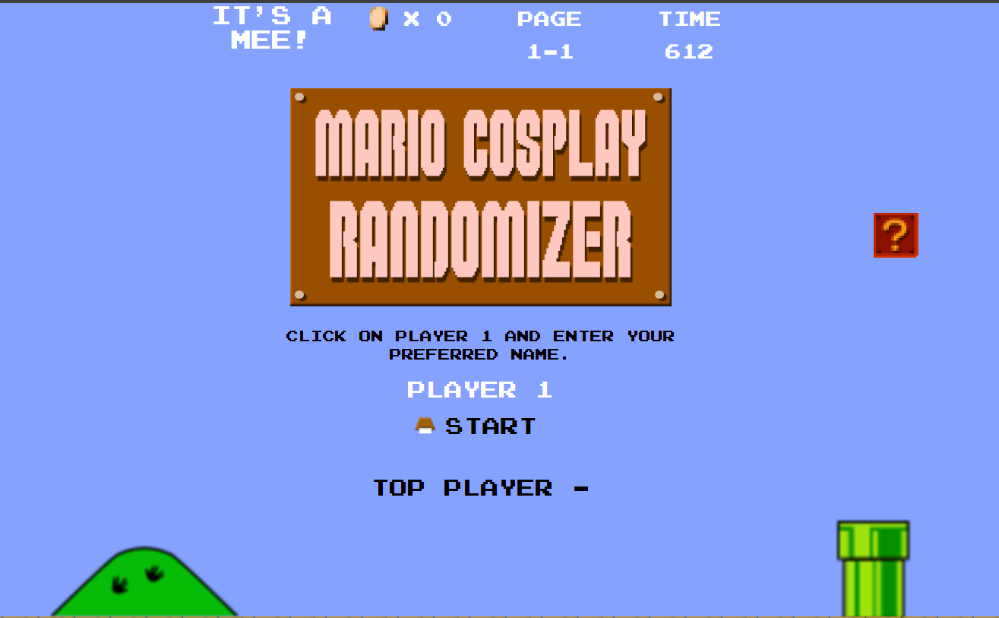

<!-- PROJECT LOGO -->
 

  

<h3 align="center">Mario Cosplay Randomizer</h3>

  

    Mario Cosplay Randomizer is an interactive application that provides an array of Mario cosplay ideas. It's the ideal application for enthusiasts of the Mario franchise looking for inspiration for their next cosplay.
     
    It is a group project made by three University of Minnesota Coding Boot Camp students, Keshon Mckie, Tony Kinney and Marcellus Khanyoo-Moona, as an exercise in using HTML, CSS and JavaScript to develop a web-based application with a modal window, local data storage and retrieval, and responsive web design. 
     
     
    <a href="https://github.com/github_username/repo_name">View Demo</a>
  

<!-- TABLE OF CONTENTS -->

  
Table of Contents

  <ol>
    <li>
      <a href="#about-the-project">About The Project</a>
      <ul>
        <li><a href="#built-with">Built With</a></li>
      </ul>
    </li>
    <li><a href="#usage">Usage</a></li>
    <li><a href="#contributing">Contributing</a></li>
    <li><a href="#license">License</a></li>
    <li><a href="#contact">Contact</a></li>
    <li><a href="#acknowledgments">Acknowledgments</a></li>
  </ol>

<!-- ABOUT THE PROJECT -->
## About The Project

  <a href="https://github.com/github_username/repo_name">
    
  

(<a href="#readme-top">back to top</a>)

### Built With

* Bootstrap
* Javascript
* HTML
* CSS

(<a href="#readme-top">back to top</a>)

### Prerequisites

You must have a working internet connection to access the site. Once you have a working internet connection, you can discover which form of Mario best suits you by entering your name in the provided box. 

<!-- USAGE EXAMPLES -->
## Usage

This project can be used to determine what form of Mario suits you for your application such as cosplaying. It is for entertainment purposes only. 

(<a href="#readme-top">back to top</a>)

<!-- CONTACT -->
## Contact

Keshon Mckie: https://github.com/keshon16  
Tony Kinney: https://github.com/sketchyTK  
Marcellus Khanyoo-Moona: https://github.com/Mkhanyoo

Project Link:[(https://github.com/keshon16/Project-1-it-s-mee/tree/main)]

(<a href="#readme-top">back to top</a>)

<!-- ACKNOWLEDGMENTS -->
## Acknowledgments

Nintendo of America owns all licences to Mario, Super Mario, et al. 

Website font is <a href="https://fontstruct.com/fontstructions/show/1332355/arcade-classic-2-19" target="_blank">Super Mario Bros. NES</a> by TheWolfBunny.

Banner image is <a href=" https://www.fontspace.com/super-plumber-brothers-font-f9287" target="_blank">Super Plumber Brothers Font</a> by Jackster Productions. 

(<a href="#readme-top">back to top</a>)

<!-- MARKDOWN LINKS & IMAGES -->
<!-- https://www.markdownguide.org/basic-syntax/#reference-style-links -->
